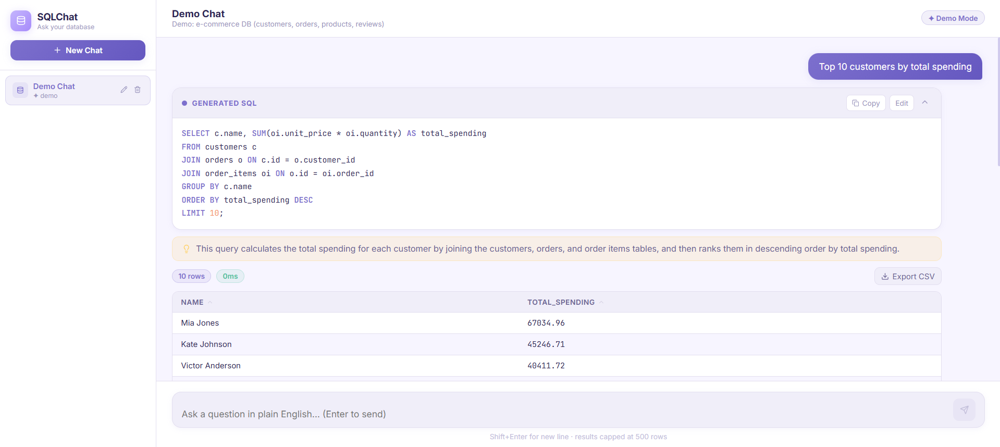

# SQLChat — Ask your database anything

> Natural language to SQL, powered by Groq. Demo mode works instantly, or connect your own database.

---

## Quick Start

Live Demo: https://sqlchat-erb2.onrender.com

---

## Preview




### 1. Backend
```bash
cd backend
py -3.12 -m venv venv
venv\Scripts\activate        # Windows
source venv/bin/activate      # Mac/Linux

pip install -r requirements.txt

# Copy and edit env
copy .env.example .env       # Windows
cp .env.example .env          # Mac/Linux
# Add your GROQ_API_KEY to .env

uvicorn app.main:app --reload
# Runs on http://localhost:8000
```

### 2. Frontend
```bash
cd frontend
npm install
npm run dev
# Runs on http://localhost:5173
```

### 3. Get a Groq API Key
- Go to https://console.groq.com
- Create a free account
- Generate an API key
- Either add it to `backend/.env` OR paste it in the sidebar settings panel

---

## Features

| Feature | Details |
|---------|---------|
| Demo mode | Pre-loaded e-commerce DB (200 customers, 60 products, 1000+ orders) |
| Real DB | Connect PostgreSQL or SQLite via connection string |
| AI to SQL | Groq LLM converts plain English to SQL |
| Context | Conversation history — follow-up questions work |
| SQL editor | Edit generated SQL inline and re-run |
| Syntax highlight | Keywords, strings, numbers highlighted |
| Results table | Sortable columns, pagination, CSV export |
| Query history | All queries saved per session |
| Multi-session | Multiple chat sessions, rename/delete |

## Demo Database Schema

```
customers   - 200 customers with tiers (bronze/silver/gold/platinum)
products    - 60 products across 6 categories
orders      - 1000+ orders with status tracking
order_items - Line items per order
reviews     - 500 product reviews with ratings
coupons     - Discount codes
```

## Example Questions to Try
- "Show me the top 10 customers by total spending"
- "Which product categories have the highest average rating?"
- "What's the monthly revenue for the last 6 months?"
- "Find customers who placed more than 5 orders"
- "Which products are low on stock?"
- "Show cancelled orders with customer names"

## Environment Variables

```env
GROQ_API_KEY=gsk_...
GROQ_MODEL=llama-3.3-70b-versatile
DATABASE_URL=sqlite+aiosqlite:///./sqlchat.db
SECRET_KEY=change-me-in-production
FRONTEND_URL=http://localhost:5173
```

## Deploy

### Render (Backend)
- Root: `backend`
- Build: `pip install -r requirements.txt`
- Start: `uvicorn app.main:app --host 0.0.0.0 --port $PORT`
- Env vars: `GROQ_API_KEY`, `FRONTEND_URL`

### Vercel (Frontend)
- Root: `frontend`
- Build: `npm run build`
- Output: `dist`
- Env: `VITE_API_URL=https://your-backend.onrender.com`
